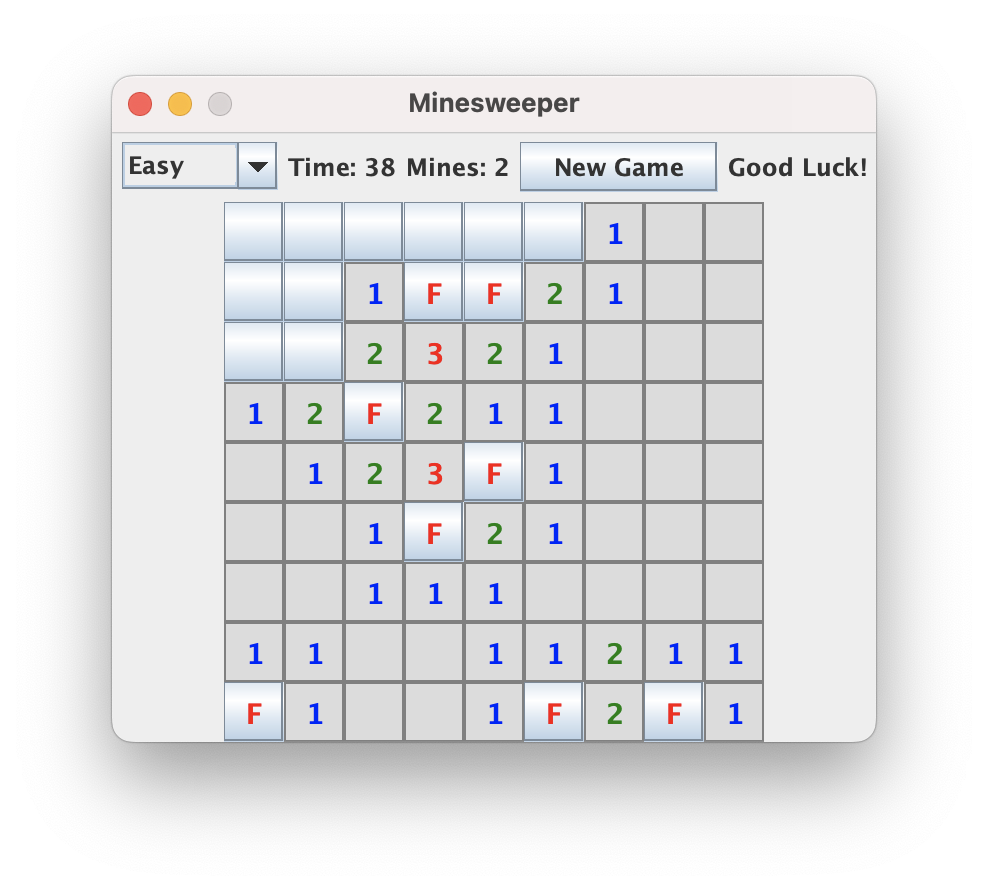

# Minesweeper in Java

A classic Minesweeper game built from scratch in Java, with a graphical interface using Swing.



## Features

- **Three difficulty levels**: Easy (9x9, 10 mines), Medium (16x16, 40 mines), Hard (16x30, 99 mines)
- **Safe first click**: mines are placed only after the first click, never on or around the clicked cell
- **Automatic opening of empty areas** using a recursive flood fill algorithm
- **Flags** and a **mine counter** (mines minus placed flags)
- **Timer** that starts on the first click, running on a separate thread
- **New Game** button and difficulty selector
- All mines are revealed when you lose (the mine you clicked is shown in red), and automatically flagged when you win
- Classic colored numbers and the same look on macOS, Windows and Linux
- A **terminal version** of the game (`ConsoleGame`) that uses the same game logic

## How to Play

| Action | Control |
|---|---|
| Open a cell | Left click |
| Place / remove a flag | Right click (or **Ctrl + click** on Mac) |

- A number shows how many mines are in the 8 surrounding cells.
- Opening a cell with no surrounding mines automatically opens its neighbours.
- You win when every cell without a mine is open. Flags are optional.

## How to Run

**Option 1: Download**

Download `Minesweeper.jar` from the [Releases](https://github.com/clever-snake/MineSweeper/releases) page and double-click it.
Requires Java 17 or newer.

**Option 2: From source**

```bash
javac -d out *.java
java -cp out Main
```

To play the terminal version instead:

```bash
java -cp out ConsoleGame
```

Commands have the form `o row column` to open a cell and `F row column` to flag one (rows and columns start at 0).

## Project Structure

| File | Responsibility |
|---|---|
| `Cell.java` | State of a single cell: mine, revealed, flagged, number of adjacent mines |
| `Board.java` | Game logic: mine placement, adjacent mine counts, flood fill, win/loss checks |
| `MineSweeperGUI.java` | Graphical interface (Swing): buttons grid, mouse input, timer, difficulty levels |
| `ConsoleGame.java` | Text-based version for the terminal |
| `Main.java` | Entry point for the graphical version |

The game logic (`Board`) is completely independent of the interface. The same class powers both the graphical and the terminal version without any changes.

## What I Learned

- Object-oriented design and separating game logic from presentation
- Recursion, through the flood fill algorithm
- Event-driven GUI programming, first with AWT and then with Swing (mouse and action listeners)
- Cross-platform testing: native AWT buttons looked and behaved differently on Windows, so the interface was moved to Swing for a consistent result
- Multithreading: running the timer on its own thread and updating the GUI safely with `SwingUtilities.invokeLater`
- Version control with Git and GitHub
